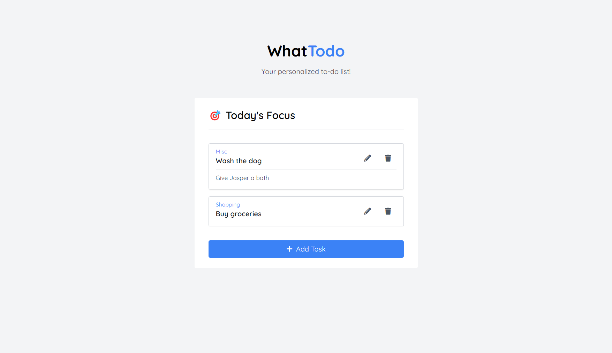

# WhatTodo

This is a simple todo app built with PHP. It allows users to add, update, and delete tasks.

## Features

- User can view all tasks
- User can add a new task
- User can update an existing task
- User can delete a task
- User can view tasks by category

## Requirements

- PHP 7.4 or higher
- A web server with PHP support
- A database (PostgreSQL is recommended)

## Installation

1. Clone this repository
2. Create a new PostgreSQL database (or use an existing one)
3. Create an `.env` file from the `.env.example` file and update the database credentials
4. Import the `todos.sql` file to create the `todos` and `categories` tables
5. Start the web server and visit `http://localhost/` (or your domain)

## License

This project is licensed under the [MIT License](LICENSE).
